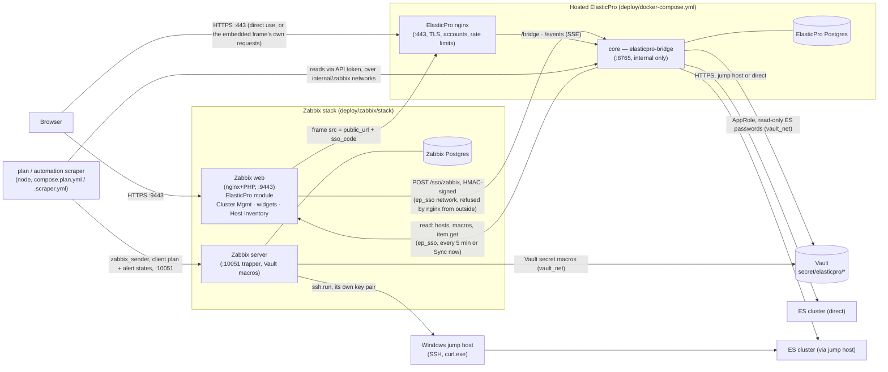

# Integrating ElasticPro with Zabbix 7.0 — a first install, start to finish

For an operator who knows Docker and Zabbix basics and has never touched this repo. It walks
a fresh Zabbix 7.0 through every ElasticPro piece in the order that actually works, with
the command, what you should see, how to check it, and the fix for the failure that turns up
most often. It is the ordered walk-through; [README.md](README.md) is the reference each step
links into, and [../PRODUCTION.md](../PRODUCTION.md) is the rollout runbook for adding Cluster
Management to a Zabbix that already has the base templates. Accurate to the code at v0.1.0.

> **Connecting an ElasticPro and a Zabbix 7.0 that already run? Start with pairing, not
> with this page.** Since the pairing flow, the ElasticPro ↔ Zabbix connection (sign-in from
> Zabbix and the cluster sync's API token) is set up from the two UIs: copy
> `module/elasticpro/` to the Zabbix frontend and enable it, then ElasticPro →
> Config → Zabbix → **Pair with Zabbix** gives a one-time code that you paste into Zabbix →
> Administration → **ElasticPro**. No secret files, no compose overlay, no nginx edit,
> no hand-made API token. The step-by-step guide with screenshots is
> [../../docs/wiki/zabbix-elasticpro-quickstart.md](../../docs/wiki/zabbix-elasticpro-quickstart.md);
> the reference is [README.md](README.md), *Setting it up from the Zabbix UI (pairing)*.
>
> This page remains the **server-managed alternative** and the full build-out: secrets in
> files, `ELASTICPRO_ZABBIX_*` on the core and `config.php` in the module (all of which win over
> pairing, field by field), plus Vault, the Clients module, templates, scraper and
> dashboards. Where Step 8 below writes secret files and `config.php` by hand, pairing is the
> shorter path to the same result.

## 1. What you get

| Piece | What it is | Where it lives |
|---|---|---|
| **ElasticPro** page inside Zabbix | The whole app, embedded, signed in as your Zabbix user — no second password | `module/elasticpro/` |
| **Cluster Management** (Clients page) | Per-client status, setup checks, DL alerts, weekly PDF reports, Windows jump-host (SSH) monitoring | `integration/zabbix/clients-module/` (`ep_clients`) |
| **Client capacity** / **Client resources** / **Volume report** widgets | Cross-client dashboards: requested/allocated/used, storage plan, CSV/Excel export | `integration/zabbix/capacity-widget/`, `resources-widget/`, `volume-widget/` |
| **Host Inventory** | Every Linux/Windows host and website Zabbix monitors, one list, `inv:` tags | separate repo, `zabbix-host-inventory` |
| **Templates** | `Elasticsearch Cluster by HTTP EP`, `Linux by Zabbix agent -EP` (base); `ElasticPro client plan`, `alerts`, `log delay` (per-cluster, fed by the scraper); `ElasticPro` (fleet-wide automation document); `ElasticPro client master` + jump-host + cluster-devices templates (written by the Clients page) | `deploy/zabbix/*.yaml`, `zbx_export_templates_ES_Linux.yaml` (repo root) |
| **SSO** | HMAC-signed sign-in from the Zabbix module into the core; Zabbix user type maps to an ElasticPro role | `compose.sso.yml`, `module/elasticpro/lib/SsoClient.php` |
| **Clusters from Zabbix hosts** | Any host carrying the cluster template becomes an ElasticPro cluster; passwords from Vault | `compose.hosts.yml`, Config → Zabbix in the app |
| **Scraper / plan / alerts / log delay** | Reads through the core, pushes the client storage plan and alert states to each cluster's host every minute; a separate fleet-wide automation document served over HTTPS and polled by the `ElasticPro` template | `compose.plan.yml`, `compose.scraper.yml`, `elasticpro-scrape.service`/`.timer` |
| **Dashboards** | "ElasticPro — Fleet" (forwarders/parsers/ES nodes, cluster health, client plan, trends); "— Client capacity" / "— Client resources" (cross-client) | `setup/zbx_dashboard.py`, `integration/zabbix/master/import.py` |

### Architecture



Every request the embedded frame makes for the app itself — `/bridge`, the `/events` stream —
goes straight to ElasticPro's own nginx, never through Zabbix's; only the sign-in exchange
crosses the `ep_sso` network. See README.md, "Inside Zabbix", for the full detail
on what that means for sessions, rate limits and the fleet cache.

## 2. Prerequisites & sizing

**Versions.** Zabbix 7.0 (LTS; the Docker images used below are `alpine-7.0-latest`). ElasticPro
core `0.1.0` or later. Docker Compose v2. Node 22 (only inside the scraper containers — the
image supplies it). PHP 8 (only inside the Zabbix web image). HashiCorp Vault 1.18 (community
edition; OpenBao works unchanged) if you use it for passwords — see step 3.

**Ports** (from README.md, "One host, both stacks" — the layout this guide assumes, one host
running everything for a first install):

| Port | Who | Exposed as |
|---|---|---|
| 443 | ElasticPro nginx | `${LISTEN:-443}`, all interfaces |
| 9443 | Zabbix frontend | `${ZBX_HTTPS_PORT:-9443}`, all interfaces |
| 10051 | Zabbix server (trapper, active agents) | all interfaces |
| 10050 | Zabbix agent 2 (this host) | host network |
| 8200 | Vault | `127.0.0.1` only |
| 8025 | jump-sim mail catcher (tests only) | `127.0.0.1` only |
| 8765 | ElasticPro core | **never published** — internal compose network only |
| 22 | each Windows jump host | from the Zabbix server only |

Nothing else is published: both Postgres instances, Redis, the Zabbix web service and the core
stay on their compose networks (`deploy_internal`, `zabbix_zbx`, `ep_sso`, `vault_net`).

**Memory, on a 4 GB host that also runs Elasticsearch.** The container memory caps, as shipped,
add up to more than a 4 GB box has (ES 1.6 + core 1.0 + Zabbix 1.4 + Vault 0.3 + scrapers 0.2 ≈
4.5 GB before the OS). If this is a shared/small host, size down before you start:

| Container | Default cap | On a shared 4 GB host |
|---|---|---|
| ElasticPro core | 1g | `ELASTICPRO_MEM_LIMIT=512m` with `ELASTICPRO_CACHE_MB=64` in `deploy/.env` |
| Redis (`--profile cache`) | 640m | leave the profile off |
| Zabbix db / server / web / web-service / agent | 320m / 384m / 256m / 384m / 64m | keep as shipped |
| Vault + unsealer | 256m + 64m | keep as shipped |
| plan scraper, automation scraper | 192m each | keep as shipped; run only one if memory is tight |
| jump-sim | ~256m | tests only — never run it in production |

That lands around 4.2 GB of caps against typical use well under 3 GB. Watch `docker stats` for
a week before trusting it, and give Elasticsearch's heap priority — it is the container that
loses data if the kernel kills it.

**DNS / firewall.** The Zabbix server needs outbound to every monitored cluster (or its jump
host) and to Vault; the core needs outbound to Zabbix's API and to Vault; the Zabbix server
needs inbound 10051 from every agent/host; each Windows jump host needs inbound 22 from the
Zabbix server only. **Build containers need DNS too.** Building the core image (`docker compose build core`,
`deploy.sh`) runs `apt-get` inside BuildKit's build container. On hosts where Docker's build
network cannot reach a resolver — seen on Ubuntu 24.04 with systemd-resolved, where plain
containers resolve fine but builds fail with `Temporary failure resolving 'deb.debian.org'` /
`Package 'ca-certificates' has no installation candidate` — build on the host network with an
override file:

```yaml
# /tmp/buildnet.yml
services:
  core:
    build:
      network: host
```

```bash
docker compose -f docker-compose.yml -f /tmp/buildnet.yml build core
```

The alternative is to never build on the server: build the image once in CI or on a build
machine and deploy it with `deploy/deploy.sh --image <repo>/elasticpro-core:<version>`.

**TLS.** Two independent certificate pairs: `deploy/tls/{fullchain.pem,privkey.pem}` for
ElasticPro's nginx, and `deploy/zabbix/stack/tls/{ssl.crt,ssl.key,dhparam.pem}` for the
Zabbix frontend. `stack/setup.sh` makes a self-signed pair for the Zabbix side if none exists;
do the same for ElasticPro's (`deploy/README.md`, step 2) or bring a real one for both.

**Vault, or the test-only plain-secret path.** The project's decision for real clients is a
Vault-backed `{$ELASTICSEARCH.PASSWORD}` macro — Zabbix's own Secret-text macros are unreadable
through the API, so ElasticPro could never read one back. `deploy/vault/` runs that Vault.
A test box with no Vault at all can use `zbx_templates.py --plain-secret <file>` instead, which sets
a plain Secret-text macro and prints a warning that it is for test installs only. Decide now —
step 3 and step 7 both branch on this.

## 3. Step by step

Run every script in this section from `deploy/zabbix/` unless a step says otherwise; that
matches what `setup/README.md` documents. The scripts find `stack/secrets/zabbix-accounts.txt`
from their own location, but the templates file is still looked up from the working directory
(`deploy/zabbix/`, then the repo root). Every script is idempotent — re-running one after a failure is safe.

### Step 1 — hosted ElasticPro stack up

**Purpose.** The app itself, so there is something for Zabbix to embed and sync against.

```bash
cd deploy
cp .env.example .env
mkdir -p tls && openssl req -x509 -newkey rsa:4096 -nodes -days 825 \
  -keyout tls/privkey.pem -out tls/fullchain.pem -subj "/CN=elasticpro.internal"
mkdir -p secrets && openssl rand -base64 32 > secrets/db_password
docker compose up -d --build
```

Optional Redis cache layer (a second cache, not required — see README.md "Scaling to a large
fleet"):

```bash
mkdir -p secrets/redis
openssl rand -hex 32 > secrets/redis/redis_password
docker compose --profile cache up -d
```

**Expect.** `docker compose ps` shows `core`, `nginx`, `db` healthy; `core` shows `8765/tcp`
with no host mapping (that is the image's `EXPOSE` metadata, not a published port — a mapping
would read `0.0.0.0:8765->8765/tcp`, as nginx's 443 does).

**Verify.** `https://<host>/` shows the sign-in page. The first account is `elasticpro`, with a
password generated for this install: `docker compose exec core cat
/app/data/initial-admin-password` (or `docker compose logs core | grep "created the first
one"`). Signing in forces a new password (10+ characters) and deletes that file.
`ELASTICPRO_INITIAL_ADMIN_PASSWORD_FILE` — a mounted file, never the password itself — sets the
first password instead. `deploy/trial.sh`
runs the same checks CI does (no credentials → 401 at the edge if you turned basic auth back
on; a write appears in the core's audit log under the signed-in user's name; the core is
unreachable from outside the compose network).

**Common failure → fix.** Port already taken: `docker compose logs nginx` names it; free the
port or change `LISTEN` in `.env`. `docker compose ps` shows `8765/tcp` with no mapping and
that is correct, not a leak — see README.md, "Trying it on one machine first".

### Step 2 — Vault (or the test-only plain-secret path)

**Purpose.** Somewhere both ElasticPro and Zabbix can read Elasticsearch passwords from,
without either storing the real value.

```bash
cd ../vault   # deploy/vault
docker network create vault_net
docker compose up -d
./setup.sh
```

**Expect.** `secrets/vault-init.json` (unseal key + root token, 0600 — keep it offline in
production), `../secrets/vault_role_id` / `vault_secret_id` (ElasticPro's read-only
AppRole), `../secrets/vault_write_role_id` / `vault_write_secret_id` (write-only, for
`zabbix.createHosts` later), and `../zabbix/stack/secrets/zabbix-vault.env` (the Zabbix
server's read-only token). `setup.sh` also starts a **test-only** `unsealer` container that
re-unseals Vault after a restart from a key kept on the same host — replace it with real
auto-unseal (a cloud KMS or a Transit Vault) before this is a production install; the comment
in `deploy/vault/docker-compose.yml` says the same thing.

**Verify.** `docker compose exec vault vault status` (inside `deploy/vault`) shows
`Sealed: false`.

**No Vault on this box?** Skip this step. `zbx_templates.py --plain-secret <file>` (step 5) sets a
plain Secret-text macro instead, and step 8 (clusters from Zabbix hosts) and the
`zabbix.createHosts` provisioning path (step 9) are not available without Vault — passwords for
those stay in the config file's own sealed secrets, or you use **Use ElasticPro credentials**
(README.md, "Passwords: Vault, or ElasticPro's own").

**Common failure → fix.** `secrets/zabbix-vault.env is missing` when bringing the Zabbix stack
up in step 4: run this step first — that file is exactly what step 4 needs and refuses to start
without.

### Step 3 — Zabbix stack up

**Purpose.** Zabbix itself, sized for a small shared host, with the module folders already
mounted.

```bash
cd ../zabbix/stack   # deploy/zabbix/stack
sudo ./setup.sh
```

Run this with `sudo` (or as root): the Zabbix images run as uid 1997 / gid 1995, and the script
needs to `chown` `secrets/db_password` and `tls/ssl.key` to that user. Run any other way, it
prints the exact `sudo chown`/`chmod` to run by hand instead — do that before continuing, or
the containers that read those files crash-loop (`db`) or answer 500 for everything (`web`)
with nothing in the log saying "permission" until you go looking for it.

**Expect.** `secrets/db_password`, a self-signed `tls/ssl.{crt,key}` + `dhparam.pem` (replace
with a real pair when you have one), the `ep_sso` and `vault_net` external networks, and the
stack up. The script also warns (but does not fail) if `../module/ep_capacity` etc. are not
in place yet — that is step 4 — and if `../module/elasticpro/config.php` does not exist yet
— that is step 6.

**Verify.** `https://<host>:9443/` shows the Zabbix sign-in page (self-signed cert warning is
expected). Default credentials are `Admin` / `zabbix` — change them now (the next step does
this for you).

**Common failure → fix.** `secrets/zabbix-vault.env is missing` — you skipped step 2 (Vault) or
ran it in the wrong order; go back and run `deploy/vault/setup.sh` first. A file left
`root:test 600` (or any owner but 1997:1995) makes `db` crash-loop or `web` fail TLS/PHP
silently — re-run `sudo ./setup.sh`, or the exact `chown`/`chmod` it names.

### Step 4 — install the Zabbix modules

**Purpose.** Copy `elasticpro`, `ep_clients`, `ep_capacity`, `ep_resources`, `ep_volume`
into place, so the stack's bind mounts have something to serve.

```bash
cd ../..   # back to deploy/zabbix
EP_HOST=<this-host-address> \
  deploy/zabbix/install-modules.sh --docker   # run from the repo root, or adjust the path
```

(Package-install Zabbix, not Docker: `ZABBIX_URL=https://zabbix.example.com ZABBIX_TOKEN=<super
admin API token> sudo deploy/zabbix/install-modules.sh` — see PRODUCTION.md step 4 for the
non-Docker layout.)

`--docker` points the five modules at `deploy/zabbix/module/*`, which the stack's
`docker-compose.yml` already bind-mounts read-only into the `web` container — nothing to copy
by hand.

**Expect.** Five `✓ <module>` lines. With `ZABBIX_URL`/`ZABBIX_TOKEN` also given, it registers
and enables them and runs `integration/zabbix/master/import.py` — which, on a **fresh** Zabbix,
exits asking you to import the base templates first (it needs `Elasticsearch Cluster by HTTP
EP`, `Linux by Zabbix agent -EP`, `ElasticPro client plan`, `alerts`, `log delay`
already there). That is expected at this point in a fresh install — do step 5 first, then
re-run this command's registration half, or just enable the modules by hand for now:
**Administration → General → Modules → Scan directory**, enable all five.

**Verify.** `docker compose -f deploy/zabbix/stack/docker-compose.yml up -d web` (picks up the
new mounts), then **Administration → General → Modules** lists all five as enabled.

**Common failure → fix.** A stale copy in a module's folder from a previous run: the script
tars the source into a staging directory first and only replaces the folder's *contents*, never
the folder itself (Docker's bind mount would otherwise vanish under a running container) — a
mismatch is usually an old checkout; `git status`/`git log` in the repo you ran this from.

### Step 5 — Zabbix accounts, base templates, the ES sync identity

**Purpose.** Three scripts: replace the default password and make test users, import the base
templates and one cluster host, and mint ElasticPro's own read-only Zabbix API identity.

```bash
cd deploy/zabbix
python3 setup/zbx_setup.py --host <this-host-address>
python3 setup/zbx_templates.py  --host <this-host-address>          # Vault path
# no Vault:
# printf '%s' '<es-password>' > /tmp/es-password && chmod 600 /tmp/es-password
# python3 setup/zbx_templates.py --host <this-host-address> --plain-secret /tmp/es-password
python3 setup/zbx_api_user.py
```

The base template names default to the ones in `zbx_export_templates_ES_Linux.yaml`. A Zabbix
that already names them something else takes `--cluster-template` / `--es-template` /
`--linux-template` (or `ELASTICPRO_ZABBIX_CLUSTER_TEMPLATE` / `ELASTICPRO_ZABBIX_ES_TEMPLATE` /
`ELASTICPRO_ZABBIX_LINUX_TEMPLATE`) — give the core the same cluster-template name in step 8, or it
syncs nothing.

Every one of these needs the VM's own address — `--host` or `$EP_HOST` — for the ES host macro
and the note written into the accounts file. There is no baked-in default; a script that gets
neither exits with an error naming both ways to give it, on purpose (an earlier version of
these scripts hardcoded a previous test VM's address, which broke the first time anyone ran
them against a different machine).

**Expect.**
- `zbx_setup.py`: the module enabled, host groups `ES vm-1` / `No ElasticPro clusters`, test
  users `ep-user` / `ep-unmapped` / `ep-admin`, the Admin password replaced. Every password,
  generated here, goes to `stack/secrets/zabbix-accounts.txt` (0600) — never printed.
- `zbx_templates.py`: imports `zbx_export_templates_ES_Linux.yaml` (it looks in `deploy/zabbix/`
  first, then the repo root, where it actually lives, and prints which one it used — you do not
  need to copy it anywhere), creates host groups (`vm-1`, `Forwarders`, `Parsers`, `ESNodes`,
  `Engines`, `Elasticsearch clusters`), and creates the `vm-1 cluster` host with the cluster
  template and macros — `{$ELASTICSEARCH.PASSWORD}` as a Vault macro (`secret/elasticpro/vm-1:
  password`) or a plain Secret-text one with `--plain-secret`.
- `zbx_api_user.py`: role **ElasticPro sync** (`host.get`, `template.get`, `usergroup.get`,
  `usermacro.get`, `hostgroup.get`, `item.get` — nothing else, and no frontend access), user
  `elasticpro-sync`, token written to `../secrets/zabbix_api_token` (0640).

**Verify.** Zabbix UI: **Data collection → Hosts** lists `vm-1 cluster` with the cluster template
linked; **Data collection → Templates** lists `Elasticsearch Cluster by HTTP EP` and `Linux
by Zabbix agent -EP`.

**Common failure → fix.**
- `no host given` — pass `--host` or set `EP_HOST`.
- If using Vault and `{$ELASTICSEARCH.PASSWORD}` never resolves: check the value in Vault
  (`vault kv put secret/elasticpro/vm-1 username=elastic password=-`, README.md "Passwords:
  Vault, or ElasticPro's own") and that `stack/secrets/zabbix-vault.env` really has a live
  token, not the placeholder some test installs leave in place by mistake.
- `zbx_export_templates_ES_Linux.yaml not found` — you are not running from `deploy/zabbix/`,
  or the file genuinely is not at the repo root; `git status` will show it as untracked if it
  is there but not committed.

### Step 6 — client-plan/alerts/log-delay templates, provisioning identity, this host as a node

**Purpose.** `zbx_phase34.py` does four things in one pass: a write-only provisioning identity
(for `zabbix.createHosts` later), the three per-cluster templates linked to every cluster
host, a read-only ElasticPro API token for the scraper, and this VM registered as a Linux host
so the fleet dashboard has a real node to show.

```bash
python3 setup/zbx_phase34.py --host <this-host-address>
```

**Expect.** Role **ElasticPro provisioning** (`host.get`, `host.create`, `hostgroup.get`,
`hostgroup.create`, `template.get`, `usergroup.get`, `usergroup.update` — host creation only,
nothing that reads secrets), user `elasticpro-provision`, token written to
`../secrets/zabbix_api_write_token`. Templates `ElasticPro client plan`, `alerts`, `log
delay` imported and linked to `vm-1 cluster`. An ElasticPro API token (role `user`, minted
by the script signing in through the module itself — no ElasticPro password needed) written to
`../secrets/scraper_token` (0640) — this is the same token step 10's scraper uses. Host
`vm-1 es-node` created with the Linux template.

**Verify.** `Data collection → Templates` now also lists `ElasticPro client plan`,
`ElasticPro alerts`, `ElasticPro log delay`, each linked to `vm-1 cluster`.

**Common failure → fix.** This script must run *after* `zbx_templates.py` — it looks up the
`Elasticsearch Cluster by HTTP EP` template's existing hosts to link the new templates to.
If it reports no hosts linked, `zbx_templates.py` did not run first, or ran against a different
Zabbix.

### Step 7 — register modules, register base groups

Now that the base templates exist, finish step 4's registration half:

```bash
ZABBIX_URL=https://<this-host-address>:9443 ZABBIX_TOKEN=<super-admin-api-token> \
  --insecure deploy/zabbix/install-modules.sh --docker
```

(Or run `integration/zabbix/master/import.py` directly with the same environment variables —
that is what the line above calls.) This creates the `Elasticsearch clients`, `Log archive`,
`ESNodes`, `Parsers`, `Forwarders`, `Engines`, `ElasticPro clients` host groups, enables
`ep_clients`, and builds the `— Client capacity` / `— Client resources` dashboards.

**Common failure → fix.** `import these templates first: ElasticPro log archive S3` — that
template is optional and lives outside this repo (`elasticpro-zabbix/ulm/`, PRODUCTION.md
step 5.1); the script prints a note and continues without it rather than failing the rest of
the run. If it instead hard-exits, you are running an older `import.py` — check `git log` on
`integration/zabbix/master/import.py`; the current version treats the S3 template as optional.

### Step 8 — SSO: sign in from inside Zabbix

**Purpose.** Load the app inside Zabbix's own menu, already signed in as the Zabbix user.

```bash
cd ../..   # deploy
docker network create ep_sso
openssl rand -hex 32 > secrets/zabbix_sso_secret && chmod 640 secrets/zabbix_sso_secret
docker compose -f docker-compose.yml -f zabbix/compose.sso.yml up -d core
```

Edit `deploy/nginx/nginx.conf`: change

```
add_header Content-Security-Policy "frame-ancestors 'none'" always;
```

to name the Zabbix origin — **scheme, host and port**:

```
add_header Content-Security-Policy "frame-ancestors https://<this-host-address>:9443" always;
```

then `docker compose restart nginx`.

On the Zabbix side:

```bash
cp zabbix/module/elasticpro/config.php.example zabbix/module/elasticpro/config.php
```

Fill in `config.php`:

| Key | Value |
|---|---|
| `core_url` | `http://ep-core:8765` (how the Zabbix frontend reaches the core, over `ep_sso`) |
| `public_url` | `https://<this-host-address>` (how the **browser** reaches ElasticPro) |
| `module_secret` | the same value as `secrets/zabbix_sso_secret` |
| `verify_tls` | `false` only for a self-signed test certificate; `true` for anything real |

Then own it correctly and enable the module:

```bash
sudo chown 1997:1995 zabbix/module/elasticpro/config.php
sudo chmod 640 zabbix/module/elasticpro/config.php
```

**Administration → General → Modules → Scan directory**, enable **ElasticPro** if it is not
already (step 7 may have done this already, since `zbx_setup.py` also enables it).

**Expect.** A new **ElasticPro** entry in the Zabbix main menu, after Monitoring.

**Verify.** Click it — the app loads inside the frame, signed in with no second password.
`curl -sk -o /dev/null -w '%{http_code}\n' https://<host>/` and check the response header:
`Content-Security-Policy: frame-ancestors https://<host>:9443` names your Zabbix origin exactly.

**Common failure → fix.**
- Blank frame or an in-page error naming the cause (wrong secret, clock skew, core
  unreachable) — the core reports it directly; check `module_secret` matches
  `secrets/zabbix_sso_secret` byte for byte, and that the two clocks are within 60 seconds of
  each other (the SSO exchange rejects a bigger skew).
- 500 on the module page, nothing else changed — `config.php` is not owned `1997:1995 0640`;
  re-run the `chown`/`chmod` above. This is the single most common gotcha after any later
  `install-modules.sh --docker` re-run too, since that step does not touch an existing
  `config.php`'s ownership unless you re-run it as root.
- `frame-ancestors` missing or wrong — you edited the wrong `nginx.conf`, or forgot
  `docker compose restart nginx` after editing it.

### Step 9 — clusters from Zabbix hosts (Vault-backed passwords)

**Purpose.** Any Zabbix host carrying the cluster template becomes a cluster in ElasticPro
automatically, with its password read straight from Vault — no cluster credential ever lives in
the core's own config for these hosts.

```bash
COMPOSE_FILE=docker-compose.yml:zabbix/compose.sso.yml:zabbix/compose.hosts.yml \
  docker compose up -d core
```

**Expect.** The core now also reads `ELASTICPRO_ZABBIX_API_URL` (`http://zabbix-web-1:8080/
api_jsonrpc.php`), `ELASTICPRO_ZABBIX_API_TOKEN_FILE` (`secrets/zabbix_api_token`, from step 5),
`ELASTICPRO_ZABBIX_CLUSTER_TEMPLATE` (`Elasticsearch Cluster by HTTP EP`), and syncs every
`ELASTICPRO_ZABBIX_SYNC_SECS` (300 s by default).

**Verify.** In ElasticPro: **Config → Zabbix → Sync now**. `vm-1 cluster` should appear in
the cluster list within seconds — do not just wait for the five-minute timer on a first
install; **Sync now** is the step people skip and then file a "cluster is missing" bug for.
`setup/zbx_hosts_check.py` and `setup/zbx_e2e.py` do the same check headlessly (see step 12).

**Common failure → fix.**
- Cluster never appears: you forgot **Sync now** (or the five minutes), or the host's Zabbix
  user groups grant nobody read access to its host group — "who sees it" in ElasticPro is
  exactly Zabbix's own read permission on that host.
- `{$ELASTICSEARCH.PASSWORD}` reported unreadable: it is a Zabbix **Secret text** macro, not
  Vault — those are never returned through the API by design; switch it to a Vault macro
  (`zbx_templates.py` without `--plain-secret`) if you need ElasticPro to read it back.
- A config-file cluster at the same address is set aside only once the Zabbix one can actually
  sign in — you will not lose monitoring to a broken Zabbix cluster silently overriding a
  working one.

**Optional — config clusters become Zabbix hosts too (`createHosts`).** Turn on
`zabbix.createHosts: true` in the config (Config → Zabbix) to have every config-file cluster
Zabbix does not already have become a host on the next sync — template, macros, password stored
in Vault via the write-only `elasticpro-provision` AppRole (never written straight into Zabbix).
This needs `ELASTICPRO_ZABBIX_API_WRITE_TOKEN_FILE` / `ELASTICPRO_VAULT_WRITE_ROLE_ID_FILE` /
`ELASTICPRO_VAULT_WRITE_SECRET_ID_FILE`, already wired by `compose.hosts.yml` and already produced by
step 6 (`zbx_phase34.py`) and step 2 (`vault/setup.sh`).

### Step 10 — user groups and roles: who sees what

Nothing extra to run — this step is bookkeeping in Zabbix you should not skip.

| Zabbix user type | ElasticPro role | Clusters | Can write |
|---|---|---|---|
| User | `user` | only clusters whose host group a group they're in can read | no |
| Admin | `operator` | all | yes, behind the write unlock |
| Super admin | `admin` | all | yes, and administers the app |
| Guest | — | not signed in | — |

Accounts are created on first sign-in as `<zabbix name>@zabbix` — so a Zabbix user named
`admin` can never become the local `admin`. Role and groups are
rewritten from Zabbix at **every sign-in**: move someone between Zabbix groups and it applies
next time they open the page, no restart needed.

**Config-file clusters:** `zabbixGroups: [ES prod team, NOC]` on a cluster in
`config_cluster.json` — a Zabbix User in none of the listed groups sees no clusters, and is told
so, enforced on every request (cluster list, ES calls, jump hosts, trust decisions), not just
in what a page draws.

**Zabbix-synced clusters:** scope comes straight from Zabbix's own host-group read permission
on the host carrying the cluster template — set it once, in Zabbix, and it is done.

**Verify.** `setup/zbx_e2e.py ep-user` (or any of `Admin ep-admin ep-user ep-unmapped`)
signs in as that user through the whole chain and prints what they end up scoped to — this is
the fastest way to confirm a group change actually took effect.

### Step 11 — client-plan / alerts / log-delay scraper

**Purpose.** Push each cluster's storage plan and alert states to its Zabbix host every minute,
so the templates from step 6 have live data.

```bash
COMPOSE_FILE=docker-compose.yml:zabbix/compose.sso.yml:zabbix/compose.hosts.yml:zabbix/compose.plan.yml \
  docker compose up -d
```

The token it uses is exactly the one step 6 wrote — `secrets/scraper_token` (0640), mounted as
a Docker secret, never an environment value (so it is not in `docker inspect`). If you generated
it by hand instead: **Accounts → API tokens**, role **user** (not `guest` — the scrape reads
indices and snapshots), one line, `chmod 640`.

**Expect.** `plan-scraper` running, one loop a minute; `--indices-every 30` and `--delay-every
15` keep the expensive calls (listing every index, measuring log delay) throttled independently
of the once-a-minute cadence — see `compose.plan.yml`'s own comments for exactly why.

**Verify.** On `vm-1 cluster`'s **Latest data**, "Client plan: …" items are populating; the
"ElasticPro alerts" and "ElasticPro log delay" templates show `Reachable` and similar
items too, since this same push carries their data.

**Common failure → fix.** Nothing arrives: check `docker compose logs plan-scraper` for a token
error first (`ELASTICPRO_TOKEN_FILE … is empty` stops the run rather than scraping as nobody, on
purpose); then confirm `ZABBIX_TRAPPER` (`zabbix-server-1:10051` for this stack's own compose
project name) matches your actual Zabbix server container name if you renamed the stack.

### Step 12 — the fleet-wide automation document (optional, separate feature)

This is a different template from step 11 — one host, one JSON document, HTTP pull instead of
trapper push — for the Automation page's rules running unattended. Skip it if you don't use
Automation rules.

```bash
docker compose -f docker-compose.yml -f zabbix/compose.scraper.yml up -d
```

Add the one nginx location this needs (README.md gives the exact block — it must carry its own
`auth_basic`, since the server block no longer has one of its own):

```nginx
    location = /automation.json {
      auth_basic           "ElasticPro scrape";
      auth_basic_user_file /etc/nginx/htpasswd;
      alias /usr/share/nginx/state/automation.json;
      default_type application/json;
      add_header Cache-Control "no-store" always;
    }
```

```bash
./make-htpasswd.sh zabbix   # bcrypt, prompts for the password
docker compose restart nginx
```

Import `template-elasticpro.yaml` (Data collection → Templates → Import), link it to a
host, set `{$ELASTICPRO.URL}` (e.g. `https://<host>/automation.json`), `{$ELASTICPRO.USER}`,
`{$ELASTICPRO.PASSWORD}` (Secret text), `{$ELASTICPRO.STALE}` (default `30m`).

**Verify.** `curl -sk -o /dev/null -w '%{http_code}\n' https://<host>/automation.json` must say
`401` with no credentials — that is the only thing standing between this document and anyone
who can reach the port, since the copied server block has no `auth_basic` of its own any more.
With credentials, the same URL returns the JSON document; the host's Latest data starts
populating `generatedEpoch` and per-cluster/per-rule items from the two discovery rules.

Bare-metal alternative (no Docker): `install -m644 elasticpro-scrape.{service,timer}
/etc/systemd/system/ && systemctl daemon-reload && systemctl enable --now
elasticpro-scrape.timer` — adjust the paths in the unit for your install location first (it assumes
`/opt/elasticpro`, `/etc/elasticpro/clusters.yaml`, an `elasticpro` user).

**Common failure → fix.** The staleness trigger fires and every other item on the template
looks wrong: fix the scraper first — a dead scraper leaves stale-but-plausible-looking data
behind it, which is exactly why that trigger exists and is the one to check before anything
else on this template.

### Step 13 — dashboards

```bash
python3 setup/zbx_dashboard.py --host <this-host-address>
```

**Expect.** "ElasticPro — Fleet" dashboard: problems across clusters/forwarders/parsers/ES
nodes, top-hosts tables, cluster health and client-plan tables, and trend graphs. `— Client
capacity` and `— Client resources` were already created by step 7's `master/import.py`, and are
never rebuilt on re-import — widgets people add there stay.

**Verify.** **Dashboards** in Zabbix lists all three.

### Step 14 — end-to-end verification, one role at a time

```bash
cd stack   # zbx_setup.py / zbx_e2e.py resolve stack/secrets/... from their own file location,
           # but only when the *others* were also run from deploy/zabbix — keep every script's
           # working directory as deploy/zabbix and this is a non-issue either way
python3 ../setup/zbx_e2e.py Admin ep-admin ep-user ep-unmapped
```

**Expect**, per user: signs in to Zabbix, opens the module page, exchanges the frame's
`sso_code` for an ElasticPro session, and reports role/scope, whether `CONFIG_VIEW` leaks a
secret (it should say `none`), whether the fleet cache (`FLEET_STATE`) and the `/events` stream
scope to the same clusters as everything else, and confirms the sign-in code and the events
ticket are both single-use. It also confirms `frame-ancestors` on ElasticPro's nginx names
the Zabbix origin your browser will actually use.

`setup/zbx_hosts_check.py <user>...` is the narrower version: which clusters that user's
`ZABBIX_CLUSTERS` call returns, whether the credential resolved, whether the last sync ran.

**Verify against the table in step 10** — a User should see only mapped clusters and nothing
else; an unmapped User should see none; Admin/Super admin should see everything and (Super
admin only) be offered Config's admin items.

### Step 15 — troubleshoot-from-a-problem links

```bash
python3 setup/zbx_troubleshoot.py --host <this-host-address>
```

Adds **Troubleshoot in ElasticPro** (on a Problem) and **Open in ElasticPro** (on a
Host) to Zabbix's own menus — both go through the module, so the person opening them is signed
in as themselves and never offered a cluster their Zabbix groups do not allow.

### Step 16 — security checklist

- Port 8765 (the core) is **never** published — check `docker compose ps` shows no host mapping
  for it, on both the ElasticPro and any override compose file.
- `/automation.json` (step 12) carries its **own** `auth_basic` — a copy of that location
  without it is a public leak of every cluster's index names; verify the 401 with no
  credentials after every nginx.conf change.
- `/sso/` returns 404 from outside — verify `curl -sk https://<host>/sso/zabbix` is refused;
  that path only exists over the internal `ep_sso` network.
- Every secret in this guide is a **file**, not an environment value — `secrets/scraper_token`,
  `secrets/zabbix_api_token`, `secrets/zabbix_sso_secret`, `vault_role_id`/`secret_id`,
  `config.php`'s `module_secret`. None of them should ever show up in `docker inspect` or a
  command line (`ps`); if you set one by hand, follow the same pattern the setup scripts use
  (`umask 027`, file mode 0600/0640).
- `config.php`, `stack/secrets/db_password`, `stack/tls/ssl.key` must be owned `1997:1995` —
  anything else and the container that reads it fails closed (crash-loop or 500), not open.
- nginx's rate limits (`limit_req zone=bridge rate=20r/s burst=40`, `limit_conn zone=events 8`)
  are per client address — if people reach ElasticPro through a shared NAT/proxy, set
  `set_real_ip_from`/`real_ip_header` for it or the whole team shares one budget.
- `frame-ancestors` names the Zabbix origin exactly (scheme, host, **and port**) — anything
  looser defeats the point of naming it at all, and Zabbix behind a different port than 9443
  (or 443, if you moved it) needs the header updated to match.
- The scrape identity is a token that can be revoked, not just a name in `X-Auth-User` — prefer
  the token everywhere a bridge with real accounts is involved (everything in this guide is).

### Step 17 — upgrades & rollback

```bash
deploy/deploy.sh --pull                                          # git pull, build, switch, wait for healthy
deploy/deploy.sh --image <registry>/elasticpro-core:0.1.0     # or an image built elsewhere
deploy/deploy.sh --rollback                                       # back to the image before the last deploy
deploy/deploy.sh --all                                            # restart the whole stack, not just core
deploy/deploy.sh --dry-run                                        # show what it would do
```

It backs up `.env`, tags the new image `elasticpro-core:<version>-<commit>` (or takes
`--image`), points `ELASTICPRO_IMAGE` at it, restarts only the core and waits for its health check;
not healthy inside `--timeout` (default 180 s) and it switches back to the previous image by
itself and exits with an error.

Re-running `deploy/zabbix/install-modules.sh --docker` after a code update copies the current
five modules into place again (the previous copy goes to
`deploy/zabbix/.module-backups/<date>/`), then `systemctl reload php-fpm` for a package install,
or `docker compose up -d web` for the Docker stack, to drop PHP's opcode cache. **Re-check
`config.php`'s ownership after this** — a module re-copy does not touch it, but it is worth
confirming nothing else did either.

Templates: re-import the previous export, or restore the Zabbix DB backup.

### Step 18 — troubleshooting table

| Symptom | Likely cause | Fix |
|---|---|---|
| `db` or Zabbix `server`/`web` crash-loops right after `stack/setup.sh` | a secret/key/`config.php` not owned `1997:1995`, mode 0640 | re-run `sudo ./setup.sh` / `sudo deploy/zabbix/install-modules.sh`, or run the exact `chown`/`chmod` either script prints |
| ElasticPro menu item shows a 500, nothing else changed | `config.php` ownership reverted (e.g. after re-copying it by hand) | `sudo chown 1997:1995 module/elasticpro/config.php && sudo chmod 640 …` |
| Frame is blank, or a plain in-page error names a cause | wrong `module_secret`, clock skew > 60 s, or the core unreachable over `ep_sso` | the core's own error names which one — fix that; `module_secret` must byte-for-byte match `secrets/zabbix_sso_secret` |
| Frame refuses to load at all, browser console shows a CSP violation | `frame-ancestors` in `nginx.conf` does not name the Zabbix origin exactly (scheme+host+port) | fix the header, `docker compose restart nginx` |
| A Zabbix host with the cluster template never appears in ElasticPro | forgot **Config → Zabbix → Sync now** (or the 5-minute wait); or no Zabbix user group has read on its host group | click Sync now; check the host group's read permissions |
| `{$ELASTICSEARCH.PASSWORD}` "unreadable" | it is a Zabbix Secret-text macro, not Vault | switch to a Vault macro (`zbx_templates.py` without `--plain-secret`) — Secret-text is never returned through the API, by Zabbix's own design |
| A test box has no Vault and `zbx_templates.py` fails | Vault provider isn't set up (or you never intended to run one) | `--plain-secret <file>`, a file path, never the password itself — test installs only |
| Client-plan / alerts / log-delay items never populate | `plan-scraper`'s token file is empty or missing; `ZABBIX_TRAPPER` points at the wrong server container | `docker compose logs plan-scraper`; confirm `secrets/scraper_token` and the trapper hostname |
| The automation-document template's staleness trigger fires | the scraper (systemd timer or `compose.scraper.yml`) has stopped | fix the scraper before trusting anything else on that template — a dead scraper looks exactly like a healthy fleet otherwise |
| `/automation.json` returns 200 with no credentials | the nginx `location` was copied without its own `auth_basic` lines | add them back — the server block carries none any more |
| A cluster behind a Windows jump host shows "unreachable" only in ElasticPro | Zabbix reaches it over SSH through a jump host ElasticPro's `jump_hosts` config does not have | add the jump host under the same name/address in the core's config; Config → Zabbix names which one to add |
| `docker compose build core` fails: `Temporary failure resolving 'deb.debian.org'`, `Package 'ca-certificates' has no installation candidate` | BuildKit's build container cannot reach a resolver (plain containers still resolve) | build with a `build: network: host` override (see Prerequisites → DNS), or deploy a prebuilt image with `deploy.sh --image` |
| `install-modules.sh` (or `master/import.py`) exits "import these templates first" | run out of order — the base/per-cluster templates (steps 5–6) must exist before registration (step 7) | run steps 5 and 6 first |
| `zbx_export_templates_ES_Linux.yaml not found` | not running from `deploy/zabbix/`, or the file is genuinely missing | `find_templates_yaml()` checks `deploy/zabbix/` then the repo root and prints which it used — check both, and `git status` for an untracked copy |
| `no host given` from any `zbx_*.py` script | `--host`/`EP_HOST` omitted | pass one — there is no default, deliberately (see `_common.py`) |
| Zabbix Admin sees the Cluster Management page with no data / no buttons | working as designed — Admins get read-only, scoped to hosts they can read; only Super admin can change anything | not a bug; see clients-module README, "Read-only for Zabbix Admins" |

## 4. Appendix

### Secrets and where they live

| File | Holds | Owner / mode | Made by |
|---|---|---|---|
| `deploy/secrets/db_password` | ElasticPro's Postgres password | container-readable | `deploy/README.md` step 4 |
| `deploy/secrets/redis/redis_password` | optional Redis cache auth | container-readable | README.md, "Scaling to a large fleet" |
| `deploy/secrets/zabbix_sso_secret` | HMAC key, Zabbix module ↔ core | 0640 | step 8, by hand |
| `deploy/secrets/zabbix_api_token` | ElasticPro's read-only Zabbix API token | 0640 | `zbx_api_user.py` (step 5) |
| `deploy/secrets/zabbix_api_write_token` | write-only, `zabbix.createHosts` | 0640 | `zbx_phase34.py` (step 6) |
| `deploy/secrets/vault_role_id` / `vault_secret_id` | ElasticPro's read-only AppRole | 0640 | `vault/setup.sh` (step 2) |
| `deploy/secrets/vault_write_role_id` / `vault_write_secret_id` | write-only AppRole, `createHosts` | 0640 | `vault/setup.sh` (step 2) |
| `core-data:/app/data/initial-admin-password` | the first `elasticpro` password, until it is changed (then deleted) | 0600, container user | the core, on its first start |
| `deploy/secrets/scraper_token` | ElasticPro API token (role `user`), plan + automation scrapers | 0640 | `zbx_phase34.py` (step 6), or by hand from Accounts → API tokens |
| `deploy/zabbix/stack/secrets/db_password` | Zabbix's own Postgres password | `1997:1995`, 0640 | `stack/setup.sh` (step 3) |
| `deploy/zabbix/stack/secrets/zabbix-vault.env` | `VAULT_TOKEN` for the Zabbix server | 0600 | `vault/setup.sh` (step 2) |
| `deploy/zabbix/stack/secrets/zabbix-accounts.txt` | Admin + test user passwords | 0600 | `zbx_setup.py` (step 5) |
| `deploy/zabbix/stack/tls/{ssl.crt,ssl.key,dhparam.pem}` | Zabbix frontend TLS | key: `1997:1995` 0640; crt/dhparam: 0644 | `stack/setup.sh` (step 3) |
| `deploy/tls/{fullchain.pem,privkey.pem}` | ElasticPro nginx TLS | container-readable | step 1, by hand |
| `deploy/zabbix/module/elasticpro/config.php` | `core_url`, `public_url`, `module_secret`, `verify_tls` | `1997:1995`, 0640 | step 8, from `config.php.example` |
| `deploy/vault/secrets/vault-init.json` | Vault unseal key + root token | 0600 — keep offline in production | `vault/setup.sh` (step 2) |
| `deploy/vault/secrets/unseal_key` | test-only auto-unsealer's key | 0644 (dir 0700) | `vault/setup.sh` (step 2) |
| `zbx_export_templates_ES_Linux.yaml` | the ES + Linux template export | repo root, not `deploy/zabbix/` | not generated by this guide |

### Environment variables

**Core** (`deploy/docker-compose.yml` + the overlay files): `ELASTICPRO_BIND`, `ELASTICPRO_DATA_DIR`,
`ELASTICPRO_CONFIG`, `RUST_LOG`, `ELASTICPRO_POLL_HEALTH_SECS` (180), `ELASTICPRO_POLL_CONCURRENCY` (16),
`ELASTICPRO_CACHE_MB` (256), `ELASTICPRO_MEM_LIMIT` (1g), `ELASTICPRO_NOTIFY_DAYS` (30), `ELASTICPRO_REDIS_URL`
(built from the secret file, not set directly), `ELASTICPRO_ZABBIX_SSO_SECRET_FILE`,
`ELASTICPRO_ZABBIX_API_URL`, `ELASTICPRO_ZABBIX_API_TOKEN_FILE`, `ELASTICPRO_ZABBIX_CLUSTER_TEMPLATE`
(the setup scripts read the same variable, plus `ELASTICPRO_ZABBIX_ES_TEMPLATE` and
`ELASTICPRO_ZABBIX_LINUX_TEMPLATE`), `ELASTICPRO_ZABBIX_SYNC_SECS` (300), `ELASTICPRO_VAULT_ADDR`, `ELASTICPRO_VAULT_ROLE_ID_FILE`,
`ELASTICPRO_VAULT_SECRET_ID_FILE`, `ELASTICPRO_ZABBIX_API_WRITE_TOKEN_FILE`,
`ELASTICPRO_VAULT_WRITE_ROLE_ID_FILE`, `ELASTICPRO_VAULT_WRITE_SECRET_ID_FILE`, `ELASTICPRO_INITIAL_ADMIN_PASSWORD_FILE`
(first run only; unset = a random password in `/app/data/initial-admin-password`).

**Zabbix server** (`deploy/zabbix/stack/docker-compose.yml`): `ZBX_VAULT=HashiCorp`,
`ZBX_VAULTURL`, `VAULT_TOKEN` (from `secrets/zabbix-vault.env`, not inline),
`ZBX_STARTREPORTWRITERS`, `ZBX_WEBSERVICEURL`, the usual `ZBX_START*` poller/cache sizing.

**Zabbix web**: `EP_DATA_DIR` (Cluster Management's data folder), `HOST_INVENTORY_DATA_DIR`,
`ZBX_SERVER_HOST`, `DB_SERVER_HOST`, `PHP_TZ`, `PHP_FPM_PM*`.

**Scrapers**: `ELASTICPRO_INTERVAL`, `ELASTICPRO_TOKEN_FILE` (preferred) / `ELASTICPRO_TOKEN` / `--token` /
`--token-file`, `ZABBIX_TRAPPER` (plan scraper only).

**Zabbix agent 2**: `ZBX_HOSTNAME`, `ZBX_SERVER_HOST` (`172.16.0.0/12`, Docker's default pool —
change it if your daemon uses a different address pool), `ZBX_PASSIVE_ALLOW`,
`ZBX_ACTIVE_ALLOW`.

### Zabbix macros

| Macro | Where | Meaning |
|---|---|---|
| `{$ELASTICSEARCH.SCHEME}` / `.HOST` / `.PORT` / `.USERNAME` / `.PASSWORD` | cluster host (cluster template) | where the cluster is; `.PASSWORD` is a Vault or Secret-text macro |
| `{$ELASTICSEARCH.JUMPHOST}` | cluster host | an ElasticPro jump host id; empty = direct |
| `{$GRP.CLIENT}` | cluster host | the client name |
| `{$ELASTICPRO.URL}` / `.USER` / `.PASSWORD` / `.STALE` | automation-document host (`ElasticPro` template) | the scrape endpoint, its HTTP basic credentials, staleness threshold |
| `{$EP.DEVICE.FIELD}` / `.INDEX` | cluster-devices template | which keyword field counts devices, and which index pattern |
| `{$ULM.ES.INDEX}` / `.BRANCH.FIELD}` / `.VIA` | log-archive host | log index pattern, branch field, `zabbix` when read through the Zabbix API instead of direct |
| `{$ULM.ZABBIX.API.URL}` / `.TOKEN` | **global** macros | the Zabbix API as the server reaches it, and a Secret-text token that may read the ULM hosts |
| `{$EP.CLIENT.STATUS}` | client master host | Active / Maintenance / Disabled / Decommissioned |
| `{$CLIENT}` / `{$ROLE}` | Linux host (this VM, `zbx_phase34.py`) | which client and role this node belongs to |

### Command cheat-sheet

```bash
# Order for a fresh install (from deploy/zabbix/ unless noted):
deploy/README.md's install (deploy/)                          # step 1
../vault/setup.sh (deploy/vault/)                              # step 2
stack/setup.sh (deploy/zabbix/stack/, as root)                 # step 3
deploy/zabbix/install-modules.sh --docker                      # step 4 (copy)
python3 setup/zbx_setup.py  --host <host>                      # step 5
python3 setup/zbx_templates.py   --host <host> [--plain-secret F]   # step 5
python3 setup/zbx_api_user.py                                  # step 5
python3 setup/zbx_phase34.py --host <host>                     # step 6
ZABBIX_URL=... ZABBIX_TOKEN=... install-modules.sh --docker    # step 7 (register)
docker compose -f docker-compose.yml -f zabbix/compose.sso.yml up -d core   # step 8
docker compose ... -f zabbix/compose.hosts.yml up -d core                  # step 9
docker compose ... -f zabbix/compose.plan.yml up -d                        # step 11
docker compose -f docker-compose.yml -f zabbix/compose.scraper.yml up -d   # step 12 (optional)
python3 setup/zbx_dashboard.py --host <host>                    # step 13
python3 setup/zbx_e2e.py Admin ep-admin ep-user ep-unmapped  # step 14 (cd stack first)
python3 setup/zbx_troubleshoot.py --host <host>                 # step 15
deploy/deploy.sh --pull | --image <tag> | --rollback | --all    # step 17
```

## More detail

- [README.md](README.md) — the reference this guide walks through: authentication, "One host,
  both stacks" (ports and memory), "Inside Zabbix" (sessions, rate limits, the fleet
  cache), every trigger the automation template raises.
- [setup/README.md](setup/README.md) — what each `zbx_*.py` script does, in one table.
- [../PRODUCTION.md](../PRODUCTION.md) — rolling Cluster Management out to a Zabbix that already
  has the base templates: jump hosts, DL alerts, weekly reports, rollback.
- [../../integration/zabbix/README.md](../../integration/zabbix/README.md) — every module
  (Clients page, master template, three widgets) and how each is installed.
- [../../integration/zabbix/clients-module/README.md](../../integration/zabbix/clients-module/README.md)
  — Cluster Management in full: statuses, CSV bulk import, backups, the jump-host flow.
- [../../docs/HANDBOOK.md](../../docs/HANDBOOK.md) — the fleet cache's message contract
  (`FLEET_STATE`, `CLUSTER_DATASET`, `/events`), notification history, and the desktop app's own
  security model.
